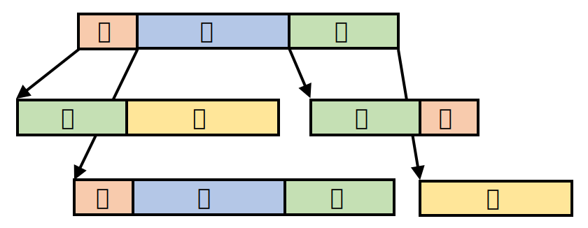
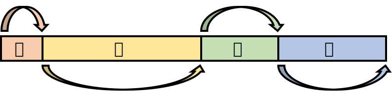
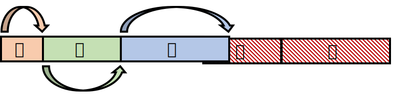
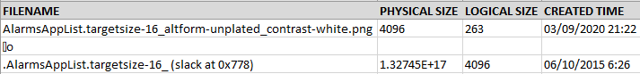
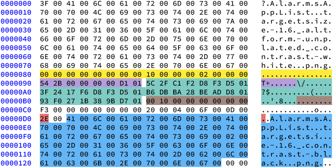
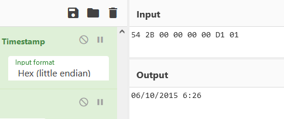
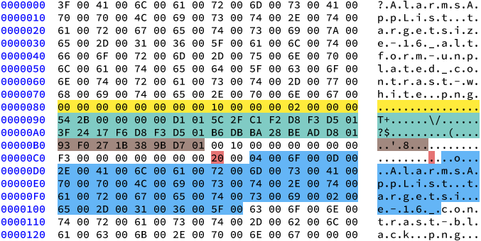

In the README page of my tool, [INDXRipper](https://github.com/harelsegev/INDXRipper) (Go check it out! It's really cool), down in the "Limitations" section, I gave some warnings regarding the reliability of the tool:

> The tool may give false results. While false positives are rare, they are possible.

> Partially overwritten entries may not be found. If they are found, though, the tool may give you false information.

These shortcomings apply to *every* $I30 parser, and in this post - I'll explain why. First, I will give an overview of directories in NTFS, and talk a bit about how $I30 parsers work. Then, I'll show you a case where a $I30 parser outputs a false entry, and explain how I try to avoid them in INDXRipper.

## NTFS Directories

In NTFS, a directory is ultimately a collection of entries - one (or more) for every file it contains. Those entries live in a sorted data structure called a B-tree, to allow fast access to files. B-trees are similar to binary search trees, except they are not binary - a node can have more than 2 child-nodes:

As you can see, each node can store multiple entries. The nodes are laid out sequentially inside an index attribute (`$INDEX_ROOT` or `$INDEX_ALLOCATION`), so a $I30 parser can iterate over them without having to deal with the tree structure.

Inside each node, the entries are sorted by filename. As the following diagram illustrates, they can have different sizes - so each entry has a 2-byte field containing the relative offset of the next entry:

When a file is moved in or out of a directory, an entry is created or removed from the tree, respectively. This sometimes causes the tree to rebalance itself - which may cause other, non-related entries to be removed from their node and re-created in another node.

Let's see what happens if entry ***B*** is removed from the above 4-entry node:

Entries ***C*** and ***D*** were simply shifted left. Now, this node contains *slack space* - space at the end of the node that isn't used by either one of the entries, and is marked here with red diagonal stripes. As you can see, it contains a complete copy of entry ***D*** and a partially overwritten copy of entry ***C*** from before they were shifted.

These diagrams showcase some of the unique qualities of this artifact:

* Not every removed entry will have remnants in slack space (Entry ***B***)
* Entries that were **not** removed may have remnants in slack space (Entry ***C*** and ***D***)
* Entries in slack space may be partially overwritten (Entry ***C***)

## Carving Entries From $I30 Slack Space

As we have just seen, the content of $I30 slack space is unpredictable. To recover file metadata from it, $I30 parsers utilize techniques that are very similar to file carving.

File carvers often rely on file signatures to detect files in unallocated space. Unfortunately, $I30 entries don't have a standard header or a fixed signature they can be detected with. However, the file metadata they contain can itself be used to build carving rules.

Most $I30 parsers base their carving rules on the set of MACB timestamps that $I30 entries contain. A sequence of 4 timestamps makes an really good carving rule, because timestamps only make sense within a very small range of values.

A Windows FILETIME timestamp has a range of +/- 29,227 years from its epoch of 1601. If you find a sequence of 4 values that are all within a reasonable range when interpreted as timestamps (say, 1990 - 2030), that's probably not a coincidence.

## False Entries

Sometimes it **is** a coincidence, though. Here's a snippet from a really weird output I got from [INDXParse](https://github.com/williballenthin/INDXParse) when I executed it on the index attribute of a directory on my system:

The file in the first line looks normal. The last two lines, however - are messed up:

* The second line is almost completely empty, except an unprintable character and a lowercase O in the filename field.

  

* The file in the third line has a physical size of roughly 118 **Petabytes**, which is a *tiny* bit more than my hard drive's storage capacity. Its name looks cut-off, and a creation time of 2015 is odd, considering all the other files in that directory were created much later.

The entry this data was pulled from is partially overwritten - which might explain this output. Let's take a look at this entry in hex, and try to figure out what's going on:

What's marked in yellow is a special entry indicating the end of a node. Everything below it is in slack space - including the entry we're interested in. Although it's partially overwritten, the file metadata inside our entry is still intact:

* The filename is marked in blue.
* The 4 MACB timestamps are marked in green.
* The file's physical size is marked in brown.
* The red byte is the filename length in characters.

What's marked in purple is the *file reference* of the parent directory. It's composed of the directory's MFT entry number (first 6 bytes) and a sequence number (last 2 bytes).

All of this file metadata is completely valid. This is the output we would have got if this entry were parsed correctly:

| Filename                                         | Physical Size | Logical Size | Creation Time |
| ------------------------------------------------ | ------------- | ------------ | ------------- |
| `AlarmsAppList.targetsize-16_contrast-black.png` | 4096          | 243          | 06/03/2020    |

INDXParse should have detected the set of 4 MACB timestamps, and should have given us this output. What went wrong? Well... everything.

By pure chance, the file reference of the parent directory is also a reasonable timestamp:

Looks familiar? It's the weird creation time from the third output line! INDXParse detected this file reference as a **timestamp**. The fields that come after it are the *actual* timestamps, so that lead to the detection of a wrong set of 4 timestamps:

This - my friends, is a false entry. It overlaps with our real entry - which makes this a bit confusing. The fields marked *here* belong to the false entry. Looking at them, it becomes clear that INDXParse detected this false entry instead of the real one.

Let's take a second look at the output of INDXParse:

* As we have just seen, the creation time in the false entry - `54 2B 00 00 00 00 D1 01`, matches the creation time in the third output line, and is actually the parent directory reference in the real entry.

  

* The physical size in the false entry (marked in brown) matches the physical size in the third output line (~118 petabytes). This value is the last access time in the real entry, which explains why it is so ridiculous as a file size.

  

* The filename (marked in blue) starts with 0x04, which is an EOT character. Then there's 0x6F, which is a lowercase O, and 0x0D - a carriage return character (CR), which excel interprets as a new line. This character sequence is actually the second output line.

  

* The rest of the filename is in the third output line. It's cut-off, because the filename length in the false entry (marked in red) is a lot shorter than the real one.

## Avoiding False Entries

Unfortunately, false entries cannot be entirely avoided. When carving data from an unstructured binary blob, there's always a risk of false positives. Nevertheless, the false positive rate can be reduced with more in-depth validation of the carved data.

The false entry shown above can be easily identified as one:

* The filename contains control characters. While most of the characters in the Unicode "Control" category are allowed in filenames, they are very rarely used in them.

  

* The file's physical size, besides being absolutely ridiculous, is not a multiple of the file-system's cluster size. This is an obvious red flag.

I implemented similar validations in *my* tool, INDXRipper - so in this case, it ignores the false entry and outputs the real one, as it should. Those validations aren't foolproof, though. $I30 slack space is unpredictable, so there's always a chance they will fail.
