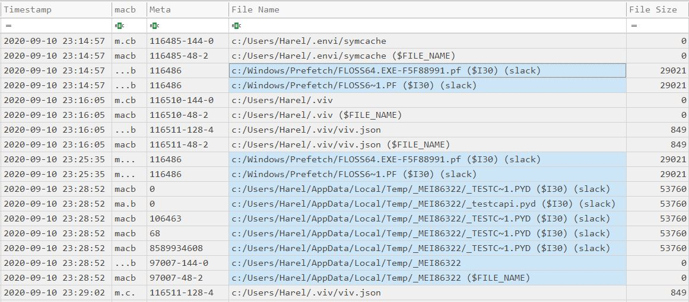
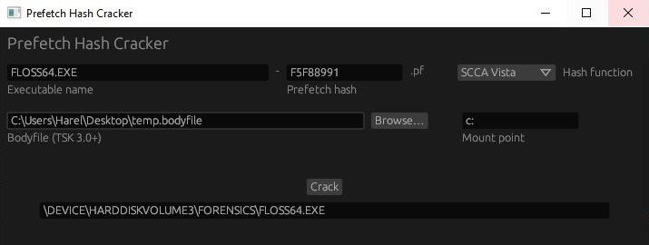

I often test my tools on my old computer at home. It's so much more interesting to investigate than a newly created virtual machine. Today, while testing, I found evidence of activity from almost 2 years ago. It got me really excited, and I thought it would make a cool blog post!


Here's a snippet from the timeline I created using MFTECmd and INDXRipper:



## A Prefetch File in $I30 Slack

The Prefetch file `FLOSS64.EXE-F5F88991.pf` was created on September 10th 2020. Today is July 2nd 2022; almost 2 years have passed! There's no trace of this file in the MFT, nor in  $J - which goes only a week back. The only thing left proving this file once existed is a $I30 entry in slack space of the Prefetch folder.

This Prefetch file must have been created because I executed Floss, which is a tool from FireEye. But `floss64.exe` is not in the MFT or in $J. It's not in my timeline, meaning INDXRipper could not find it in $I30 of any directory. I parsed the ShimCache and AmCache, but there was nothing there either.


> The $I30 of the Prefetch folder is a forensic goldmine; The $I30s from the users' Recent folders are also very valuable. When triaging a system, I usually collect the $I30s from such key folders, these are just a few examples:
> 
> ```python
> C:\Windows\Prefetch
> C:\Users\*\AppData\Roaming\Microsoft\Windows\Recent
> C:\ProgramData\Microsoft\Windows Defender\LocalCopy
> C:\Users\*\Downloads
> C:\PerfLogs
>```
> I use RawCopy to collect these; KAPE does not currently support $I30 collection.


The prefetch file was created at 23:14:57, probably right after `floss64.exe` was first executed. We can also see a last modification time at 23:25:35. If I were to find this Prefetch file in the MFT, and this last modification timestamp were from `$STANDATD_INFORMATION`, I would say that it indicates the last execution time of `floss64.exe`. However, this timestamp is from $I30 slack, so this might not be the case.

I know what you think - $I30 timestamps should mirror those in the `$STANDATD_INFORMATION` attribute! And you are absolutely right. But $I30 entries, as opposed to MFT entries, can move around throughout their lifetime. When a file is created or deleted in a directory, $I30 entries of other files in the directory may be unallocated, and then reallocated in a different place. This entry could have been unallocated while the Prefetch file was still active! In this case, the entry may contain outdated information.

## PyInstaller

Floss is written in Python, and is packaged with PyInstaller. Here's is a brief description of PyInstaller, straight from its manual:

> PyInstaller bundles a Python application and all its dependencies into a single package. The user can run the packaged app without installing a Python interpreter or any modules.


There are also details about its inner workings:

>[...] The bootloader is the heart of the one-file bundle also. When started it creates a temporary folder in the appropriate temp-folder location for this OS. The folder is named `_MEI*xxxxxx*`, where *xxxxxx* is a random number. [...] The bootloader uncompresses the support files and writes copies into the temporary folder.


At 23:28:52, The folder `_MEI86322` was created in my user's `Temp` directory, which indicates I executed a PyInstaller executable. INDXRipper was kind enough to parse the $I30 of this folder for us, so we can see a compiled python module (.pyd file) that was created inside the folder and deleted since.

My guess is that `floss64.exe` was first executed at 23:14:57, then executed again in 23:25:35, and then again in 23:28:52. The $I30 entry we found in slack space was unallocated somewhere between 23:25:35 and 23:28:52, so the last modification time wasn't updated the next time `floss64.exe` was executed.

An interesting thing to note, is that we only see a single `_MEI*xxxxxx*` folder; yet, we know a unique one should have been created for every execution of `floss64.exe`.

>When the bundled code terminates, the bootloader deletes the temporary folder. [...] The `_MEI*xxxxxx*` folder is not removed if the program crashes or is killed


This is interesting! The folder `_MEI86322` is not deleted, so `floss64.exe` might have crashed after it was executed at 23:28:52. I looked for an error report, but couldn't find one.

## Prefetch Hash Cracking

Can we find the folder from which `floss64.exe` was executed? Unfortunately, ShimCache and AmCache aren't much help this time. A cool thing we can try is to brute-force the Prefetch hash; i.e, hashing possible full paths of `floss64.exe` until the result matches the Prefetch hash, which is `F5F88991`. I wrote a little tool to do this for me; I just have to give it the bodyfile I used to create the timeline, so it can enumerate all the folders `floss64.exe` might have been executed from:




This doesn't always work, but this time it did! `floss64.exe` was executed from the Forensics directory on the C: drive.

## Wrapping Up

That's it for this post! I wanted to demonstrate both the value and the subtleties of $I30 analysis; let me know if you found that educational. Also, I'm no expert; If you think I got something wrong, please tell me. Home Adventures may become a series if I find the time for it. I may also write a detailed post about INDXRipper; Let me know if you'd be interested in that!

### Tool List

| Tool                  | Source                                              |
| --------------------- | --------------------------------------------------- |
| MFTECmd               | https://github.com/EricZimmerman/MFTECmd            |
| INDXRipper            | https://github.com/harelsegev/INDXRipper            |
| Prefetch Hash Cracker | https://github.com/harelsegev/prefetch-hash-cracker |

