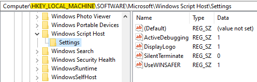
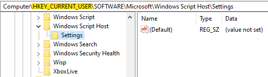
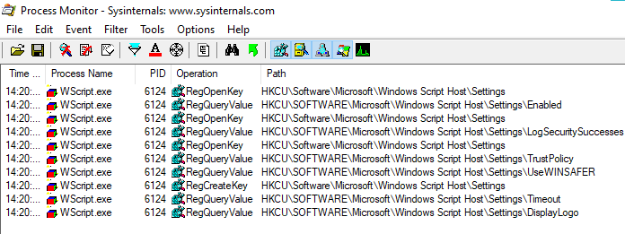

*WSH* (Windows Script Host) is an automation tool built into Windows, providing powerful scripting abilities. It was introduced in Windows 98, long predating .NET and PowerShell. Whilst being largely abandoned by system administrators, It is sometimes used by attackers to evade detection and obfuscate their infection chains.

Typically, an attacker will drop a malicious script on disk - a `.vbs`, `.js` or a `.wsf` file, and then execute it using either the WScript or the CScript host.

System-wide WSH settings are stored in the SOFTWARE hive, in the Windows Script Host key, and can be examined using the `wsh_settings` RegRipper plugin:

This post is not about *this* key, though. It's about a matching Windows Script Host key in the NTUSER.DAT hive, which stores the user-specific WSH settings:

Interestingly, the WSH key in NTUSER.DAT does not exist by default. It is only created when the user executes WScript or CScript for the first time.

Because they have their own sub-key, a change in the settings does not affect the last write timestamp of the WSH key. It won't usually change after the key is created, even if the settings are changed.

The big question is - can we use this timestamp to determine the first time a user executed WScript or CScript? Well, maybe. It depends on whether values or sub-keys *other* than Settings are ever created beneath the WSH key.

I've done some testing, and I couldn't get either WScript or CScript to create (or even query) other values or sub-keys. I believe it *never* happens. I cannot be entirely sure, but I'm somewhat confident.

If I'm right - then the last write time of the WSH key **always** indicates its creation time, and I can see all sorts of exciting things we can use this for:

* Determine the first time a user executed WScript or CScript. If WSH isn't typically used in your environment, this may be worth hunting for.

  

* Attribute the execution of a WSH script to a specific user account. If a `.js` script were dropped on disk, and a user's WSH key were then immediately created, I'd bet that user executed the script.

> **Note:** If WScript or CScript is executed with SYSTEM privileges, the Windows Script Host key will be created in the DEFAULT hive.
