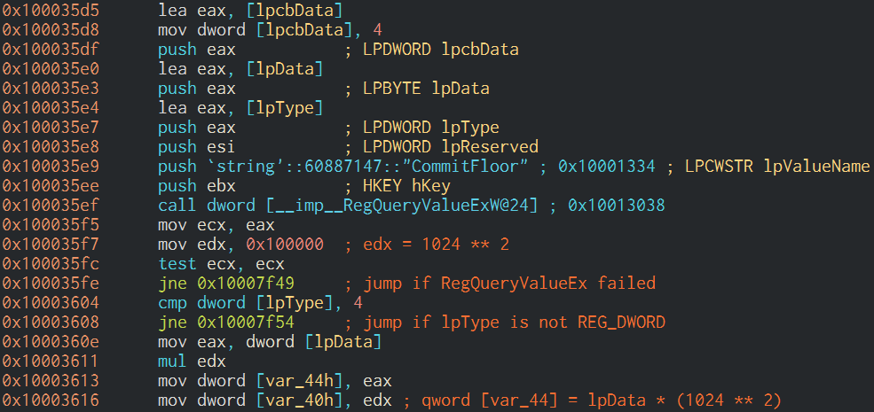

I was working on a case the other day when I first came across a rather interesting registry key, `HKLM\Software\Microsoft\RADAR\HeapLeakDetection\DiagnosedApplications`. It caught my eye, because it has sub-keys for (what appears to be) applications executed on the system. This is what it looks like on my own system:

There are quite a few sub-keys, and each has a *LastDetectionTime* QWORD value, containing what appears to be a Windows FILETIME timestamp:

This key is associated with the Memory Leak Diagnoser component of Windows Resource Exhaustion Detection and Resolution (RADAR). RADAR is a technology embedded in Windows to detect memory leaks in real-time, so that data can be collected and used to correct issues in applications.

RADAR is surprisingly old; it was introduced in Windows Vista. Nevertheless, I couldn't find any research into this registry key - so I had to conduct my own. With forensics in mind, I tried to answer these 2 questions:

* Under what conditions is a sub-key created beneath the *DiagnosedApplications* key?
* Under what conditions is the *LastDetectionTime* value updated?

My research was conducted on a Windows 10 machine, and may not apply to prior versions of Windows.

## Looking at the Settings

Luckily, there's a *Settings* key beneath the *HeapLeakDetection* key:

Settings are always helpful when you're trying to figure out how something works. Looking at these values, I already had some hypotheses, but I needed more information before I could confirm or disproof anything. Using Procmon, I was able to  pinpoint the DLL which manages the *DiagnosedApplications* registry key, *radardt.dll*:

### Reverse Engineering *RdrpReadHeapLeakSettings*

I started my analysis of the *RdrpReadHeapLeakSettings* function in *radardt.dll*, because I wanted to understand the settings better. Take *DetectionInterval*, for example; it's 0x1E, or 30 in decimal - but 30 what? seconds? minutes? I had no idea.

This turned out to be a great idea, because the function transforms each value in a way that enabled me to understand what it means. Take *CommitFloor*, for example. After reading it from the registry, it is multiplied by 1048576, which is 1024 squared. This tells me that *CommitFloor* is stored in megabytes.

These were my conclusions, after analyzing the entire function:

* *CommitFloor* and *CommitCeiling* are in MBs.
* *CommitThreshold* can be from 1 to 100 (including 1 and 100), and is set to 5 by default.
* *DetectionInterval* is in days. It can be a DWORD or a QWORD.
* *MaxReports* is set to 1 in case the value doesn't exist.
* *TimerInterval* is in minutes.

 They have something to do with the amount of committed memory a process has.
