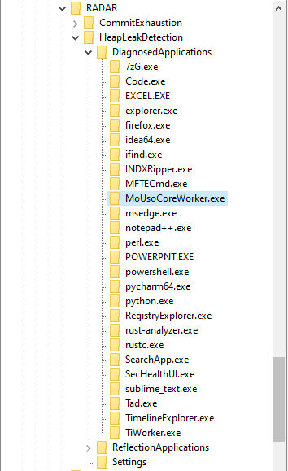
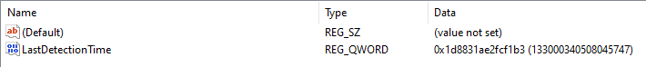
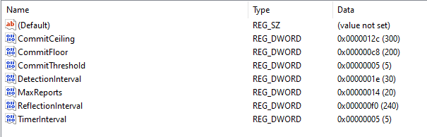
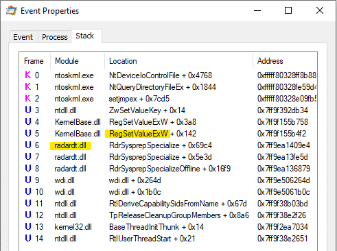
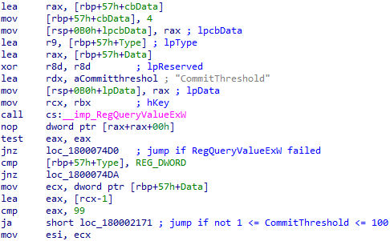
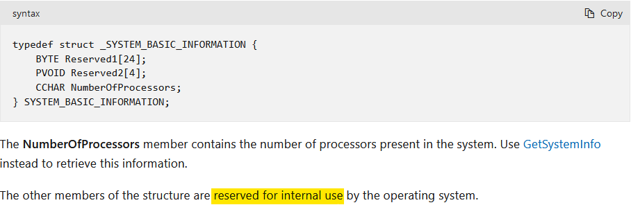
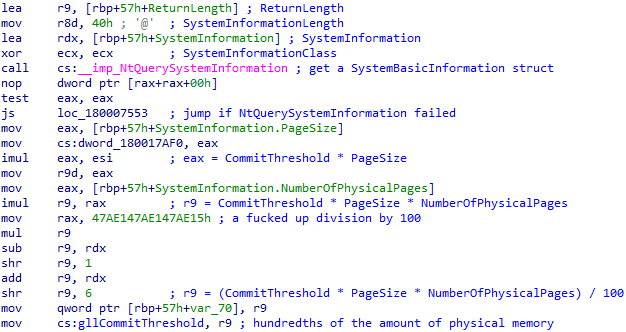
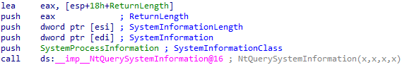
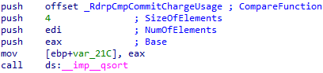

I was working on a case the other day, when I first came across a rather interesting registry key, `HKLM\Software\Microsoft\RADAR\HeapLeakDetection\DiagnosedApplications`. It caught my eye, because it has sub-keys for (what appears to be) applications executed on the system. This is what it looks like on my own system:



It has quite a few sub-keys, and each one has a *LastDetectionTime* QWORD value, containing what appears to be a Windows FILETIME timestamp:



This key is associated with the Memory Leak Diagnoser component of Windows Resource Exhaustion Detection and Resolution (RADAR). RADAR is a technology embedded in Windows to detect memory leaks in real-time, so that data can be collected and used to correct issues in applications.

RADAR is surprisingly old; it was introduced in Windows Vista. Nevertheless, I couldn't find any research into this registry key - so I had to conduct my own. With forensics in mind, I tried to answer these 2 questions:

* Under what conditions is a sub-key created beneath the *DiagnosedApplications* key?
* Under what conditions is the *LastDetectionTime* value updated?

My research was conducted on Windows 10 machines, and therefore may not apply to prior versions of Windows.

## Looking at the Settings

Luckily, there's a *Settings* key beneath the *HeapLeakDetection* key:



Settings are always helpful when you're trying to figure out how something works. Looking at these values, I already had some hypotheses. I figured whether an application is diagnosed has something to do with the amount of memory it allocated.

I had a guess that *CommitFloor* and *CommitCeiling* are actually in megabytes, and that the amount of committed memory has to lie between them for a process to be registered. That lead me to write a little C program, to test this theory:

```c
#include<stdio.h>
#include<Windows.h>

int main() {
    // set nAllocatedSize to be between CommitFloor and CommitCeiling
    size_t nAllocatedSize = 1024 * 1024 * 250;
    
    if(VirtualAlloc(NULL, nAllocatedSize, MEM_RESERVE | MEM_COMMIT, PAGE_READWRITE)) {
        printf("Committed 250 MB of memory\n");
        
        while(1) {
            printf("Sleeping...\n");
            Sleep(5000);
        }
    }
}
```

I executed the binary on 2 of my machines, and the results threw me off completely. On one of them, it was registered after a few minutes - but on the other one it wasn't registered at all. They're both running the same Windows 10 version, so what's going on?

## Reverse Engineering *RdrpReadHeapLeakSettings*

To figure this out, I needed more information. Using Procmon, I was able to pinpoint the DLL which manages the *DiagnosedApplications* registry key:



I figured I should start my analysis in the *RdrpReadHeapLeakSettings* function. I hoped it would help me understand the settings better. Take *DetectionInterval*, for example; it's 0x1E, or 30 decimal - but 30 what? seconds? minutes? I had no idea.


This turned out to be a great idea, because the function transforms each value in a way that enabled me to understand what it means. For example, the *DetectionInterval* value is multiplied by 86400 after it is read from the registry. 86400 happens to be 60 * 60 * 24. This means *DetectionInterval* is stored days, and is converted to seconds:


In a similar fashion, I was able to conclude that *TimerInterval* is stored in minutes.

*DetectionInterval* is stored in a global variable after it's converted to seconds - to make it available for other functions to use. This is also the case for *CommitThreshold*, *MaxReports* and *TimerInterval*. However, both *CommitFloor* and *CommitCeiling* aren't stored anywhere after they're read. I doubt whether they're actually used at all!

The next value I looked at is *CommitThreshold*, which seems to be 5 by default. After it is read from the registry, the function checks if it's between 1 to 100:



After that, there's a call to *NtQuerySystemInformation* to get a *SystemBasicInformation* struct. Unfortunately, the structure of this struct is not documented on MSDN:



Nevertheless, I found documentation for it on some other, rather questionable website. Then, I was able to define it as a struct in IDA Pro. What I found then, was the explanation to the confusing results of my test:



*CommitThreshold* is multiplied by `(PageSize * NumberOfPhysicalPages) / 100`. That lead me to conclude it's the amount of memory an application has to commit in order to get diagnosed, as a percentage of the total amount of physical memory on the system.

I was able to verify this theory through further testing. This artifact behaves differently depending on the amount of RAM installed in the machine.

The 250MBs my test application allocated are more than 5 percent out of the 4GBs of RAM installed in the first machine I tested on, but they're less than 5 percent out of the 8GBs installed in my other machine.

## Looking at *RdrpIdentifyTargetProcess*

What happens if the Memory Leak Diagnoser is triggered, and there are multiple processes with a high enough amount of committed memory to be diagnosed? Well, only one of them is chosen to be registered. I wanted to figure out how this choice is made, so the next function I looked at was *RdrpIdentifyTargetProcess*.

First, it calls *RdrpGetProcessInformation*, which in turn uses the *NtQuerySystemInformation* API call; this time - to get an array of *SYSTEM_PROCESS_INFORMATION* structures, one for each running process:



These structures contain information about the resource usage of each process. Later, it seems like this array is sorted by the amount of committed memory in each process:



## Answering my Research Questions

At this point, I had a ~~solid and complete~~ theory, which I have tested and verified:

The Memory Leak Diagnoser is triggered every *TimerInverval* minutes. When triggered, it gets a list of all running processes, and sorts them by their amount of committed memory (in descending order). Then, it chooses the first process on the list which:

* Has committed at least *CommitThreshold* percent out of the total amount of physical memory installed.
* Wasn't already chosen in the last *DetectionInterval* days.

A sub-key beneath the *DiagnosedApplications* key is then created (if it doesn't exist already) for the chosen process, and the *LastDetectionTime* is updated.

**Edit:** some built-in executables are chosen to be diagnosed, but are not registered.  
Why? Further research is needed.

## Closing Thoughts

That's all! I hope you found this short research interesting. This artifact is not all that powerful, because only the applications that commit a large amount of memory are registered. Nonetheless, it was quite fun to research. I'm not super experienced in using IDA and reverse engineering, but I think I did a decent job. Let me know what you think!
